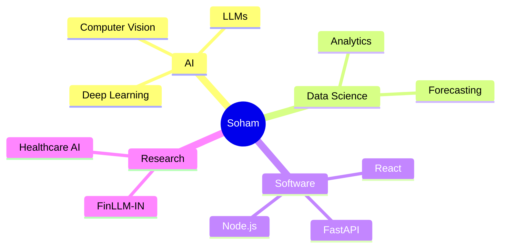

# 👋 Soham Saha

<p align="center">
  
</p>

<p align="center">

</p>

<p align="center">
<a href="mailto:sahasoham807@gmail.com"></a>
<a href="https://linkedin.com/in/soham-saha-74594721b"></a>
<a href="https://github.com/GithubSohamSaha"></a>
<a href="https://www.kaggle.com/sohamthecoder007"></a>
</p>

<p align="center">

</p>

## 🚀 About Me


### 🚀 Building AI systems that solve real-world problems.

I'm a **B.Tech Computer Science & Engineering** student at the **University of Calcutta** with a strong passion for **Artificial Intelligence, Machine Learning, Data Science, Computer Vision, and Full Stack Development**.

Currently working as a **Data Analyst Intern at Ozibook**, where I contribute to data-driven business solutions, analytics, and automation.

Previously worked as an **AI Prompt Engineer at SOUL AI**, gaining hands-on experience with Large Language Models, Prompt Engineering, and Generative AI.

I love transforming research ideas into practical software that creates measurable impact.

<br>

- 🎓 B.Tech CSE, University of Calcutta
- 💼 Data Analyst Intern @ **Ozibook**
- 🤖 Ex-AI Prompt Engineer @ **SOUL AI**
- 🔬 Building **FinLLM-IN**, AI Analytics, Computer Vision & Automation
- 🌱 Learning **RAG, Agentic AI, MLOps, Cloud**
- 🤝 Open to AI Research, Open Source & Collaboration

---

## 💼 Experience

| Role | Organization |
|------|--------------|
| Data Analyst Intern | Ozibook |
| AI Prompt Engineer | SOUL AI |
| B.Tech CSE | University of Calcutta |

---

## 🚀 Featured Projects

| Project | Description |
|---------|-------------|
| 💹 FinLLM-IN | Financial Intelligence Platform using LLMs & Deep Learning |
| 🏥 MedAI Guardian | Healthcare AI for prediction & analytics |
| 👁️ People Detection | YOLOv8 Computer Vision |
| 📚 StudyHub Publication | MERN publication platform |
| 📈 NIFTY Benchmark | Deep Learning forecasting models |

---

## 🛠 Tech Stack

### Languages
<p>

</p>

### AI & Data
<p>


</p>

### Web
<p>

</p>

### Databases & Tools
<p>

</p>

---

## 📊 GitHub Analytics

<p align="center">


</p>

---

# 📈 GitHub Activity Graph

<p align="center">
  
</p>

---

# 🏆 Achievements

<div align="center">

| 💼 Professional | 🚀 Projects | 🎓 Learning |
|:---------------:|:----------:|:-----------:|
| 📊 Data Analyst Intern @ Ozibook | 💹 FinLLM-IN | 🎓 B.Tech CSE |
| 🤖 Ex AI Prompt Engineer @ SOUL AI | 🏥 MedAI Guardian | 📚 Continuous Learning |
| 🤝 Open Source Contributor | 👁️ YOLOv8 People Detection | ☁️ AI • ML • Cloud |

</div>

---

# 🔬 Research Interests

<p align="center">


</p>

---

# 📚 Currently Exploring

```text
🧠 Large Language Models (LLMs)

🤖 Agentic AI

🔍 Retrieval-Augmented Generation (RAG)

📊 Time Series Forecasting

📈 Financial AI

⚙️ MLOps

☁️ Google Cloud

🚀 Distributed AI Systems
```

---

# 📈 Current Focus



---

# 🌍 Coding Profiles

<p align="center">

<a href="https://www.kaggle.com/sohamthecoder007">

</a>

<a href="https://leetcode.com/">

</a>

<a href="https://stackoverflow.com/users/23111757">

</a>

<a href="https://quora.com/profile/Soham-Saha-223">

</a>

</p>

---

# 📫 Let's Connect

<p align="center">

<a href="mailto:sahasoham807@gmail.com">

</a>

<a href="https://linkedin.com/in/soham-saha-74594721b">

</a>

<a href="https://github.com/GithubSohamSaha">

</a>

<a href="YOUR_RESUME_LINK">

</a>

</p>

---

<div align="center">

## 💡 Quote

> **"Building AI that creates real-world impact through research, innovation, and engineering."**

<br>


<br>


</div>

---

## 📫 Connect

- LinkedIn: https://linkedin.com/in/soham-saha-74594721b
- Email: sahasoham807@gmail.com
- Kaggle: https://www.kaggle.com/sohamthecoder007

---

> **"Building AI that creates real-world impact."**
