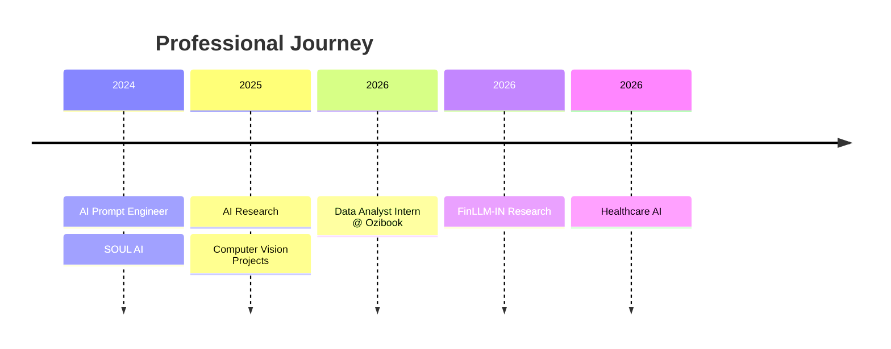

 

  

---

# 👨‍💻 About Me

### 🚀 Building AI systems that solve real-world problems.

I'm a **B.Tech Computer Science & Engineering** student at the **University of Calcutta** with a strong passion for **Artificial Intelligence, Machine Learning, Data Science, Computer Vision, and Full Stack Development**.

Currently working as a **Data Analyst Intern at Ozibook**, where I contribute to data-driven business solutions, analytics, and automation.

Previously worked as an **AI Prompt Engineer at SOUL AI**, gaining hands-on experience with Large Language Models, Prompt Engineering, and Generative AI.

I love transforming research ideas into practical software that creates measurable impact.

 

- 🔭 Currently building **FinLLM-IN**, AI Analytics Systems & Automation Projects
- 🤖 Interested in **LLMs, Deep Learning, Agentic AI, Computer Vision & Data Science**
- 🌱 Currently learning **RAG, MLOps, Cloud Deployment & Advanced Deep Learning**
- 💬 Ask me about **Python, Machine Learning, React, FastAPI, SQL, Git & Data Analytics**
- 🤝 Open to **Research Collaborations**, **Open Source**, and **AI Projects**
- ⚡ Fun fact: *I enjoy debugging complex AI systems more than solving easy coding problems.*

---

# 💼 Professional Snapshot

| 🎓 Education | 💼 Experience | 🔬 Research |
|:-----------:|:------------:|:-----------:|
| B.Tech CSE University of Calcutta | Data Analyst Intern Ozibook | FinLLM-IN |
| B.Sc Computer Science | Ex AI Prompt Engineer SOUL AI | Healthcare AI |

---

# 🛠 Tech Arsenal

## 💻 Programming Languages

---

## 🌐 Frontend

---

## ⚙ Backend

---

## 🧠 AI • Machine Learning • Data Science

---

## 🗄 Databases

---

## ☁ Cloud & DevOps

---

## 📈 Currently Exploring

| AI | Data | Cloud |
|:----:|:-----:|:------:|
| 🤖 Agentic AI | 📊 Advanced Analytics | ☁ Google Cloud |
| 🧠 Large Language Models | 📈 Time Series Forecasting | 🚀 Deployment |
| 🔍 RAG Systems | 💹 Financial AI | ⚙ MLOps |

---

### 💭 Philosophy

> **"Technology creates the greatest impact when it solves real-world problems."**

# 🚀 Featured Projects

<h3>Turning ideas into impactful AI-powered solutions.</h3>

 

<table>
<tr>

<td width="50%" valign="top">

## 💹 FinLLM-IN

**AI-powered Financial Intelligence Platform for Indian Markets**

A research-driven platform integrating Deep Learning, Reinforcement Learning, Large Language Models, and Financial Analytics for intelligent investment decision-making.

### ⚡ Highlights

- 📈 Stock Price Forecasting
- 🤖 Financial LLM
- 📊 Portfolio Optimization
- 📉 Risk Analysis
- 📰 Financial News Intelligence
- 🇮🇳 India-focused Market Analytics

### 🛠 Tech Stack

`Python`
`FastAPI`
`PostgreSQL`
`TensorFlow`
`PyTorch`
`xLSTM`
`TFT`
`RAG`
`LLMs`

</td>

<td width="50%" valign="top">

## 🏥 MedAI Guardian

**AI-powered Healthcare Intelligence Platform**

A smart healthcare system capable of predicting medicine demand, patient flow, outbreak detection, and hospital resource optimization.

### ⚡ Highlights

- 🧠 Medicine Demand Prediction
- 🏥 Bed Occupancy Forecasting
- 📊 Disease Trend Analysis
- 🚑 Healthcare Dashboard
- 🤖 AI-powered Decision Support

### 🛠 Tech Stack

`Python`
`FastAPI`
`LSTM`
`XGBoost`
`PostgreSQL`
`React`

</td>

</tr>

<tr>

<td width="50%" valign="top">

## 👁️ AI People Detection

YOLOv8-based Computer Vision System capable of accurate people detection in real-world environments.

### Highlights

- 🎯 YOLOv8
- 📷 Computer Vision
- ⚡ Real-time Detection
- 🧠 CNN

### Tech

`Python`
`YOLOv8`
`OpenCV`
`PyTorch`

</td>

<td width="50%" valign="top">

## 📚 StudyHub Publication

A complete publication management platform with role-based authentication, dashboard, payments, order management, and admin portal.

### Highlights

- 📖 Book Publishing
- 🔐 JWT Authentication
- 👨‍💼 Admin Dashboard
- 📦 Order Management

### Tech

`React`

`Node.js`

`Express`

`JWT`

`MongoDB`

</td>

</tr>

</table>

---

# 💼 Experience

---

# 🔬 Research Interests

| 🤖 AI | 📊 Data Science | 💻 Software |
|:---:|:---:|:---:|
| Machine Learning | Data Analytics | Full Stack Development |
| Deep Learning | Time Series Forecasting | REST APIs |
| Large Language Models | Financial AI | Cloud Deployment |
| Agentic AI | Predictive Analytics | Scalable Systems |
| Computer Vision | Data Engineering | System Design |

---

# 🏆 Achievements

<table>

<tr>

<td>

### 💼 Internship

**Data Analyst Intern**

Ozibook

</td>

<td>

### 🤖 AI Experience

**Prompt Engineer**

SOUL AI

</td>

</tr>

<tr>

<td>

### 🔬 Research

FinLLM-IN

Healthcare AI

Deep Learning

</td>

<td>

### 🎤 Technical Activities

IEEE Seminars

Hackathons

Workshops

Open Source

</td>

</tr>

</table>

---

# 📜 Certifications & Learning

> 📚 Lifelong learner passionate about continuously expanding my knowledge.

- 🎓 Google Professional Courses
- ☁ Google Cloud Skills
- 🤖 Machine Learning Specializations
- 🧠 Deep Learning Courses
- 📊 Data Science Certifications
- 💻 Python & Full Stack Development

---

# 🎯 Currently Working On

| 🚀 Project | Status |
|:---------|:------:|
| 💹 FinLLM-IN | 🟢 Active |
| 🏥 MedAI Guardian | 🟢 Active |
| 📚 StudyHub Publication | 🟢 Active |
| 📈 NIFTY Deep Learning Benchmark | 🟢 Active |
| 🤖 AI Automation Tools | 🟢 Active |

---

# 📊 GitHub Analytics

  

---

# 📈 Contribution Graph

---

# 🏆 GitHub Achievements

---

# 🐍 Contribution Snake

<picture>

<source media="(prefers-color-scheme: dark)"
srcset="https://raw.githubusercontent.com/GithubSohamSaha/GithubSohamSaha/output/github-contribution-grid-snake-dark.svg"/>

<source media="(prefers-color-scheme: light)"
srcset="https://raw.githubusercontent.com/GithubSohamSaha/GithubSohamSaha/output/github-contribution-grid-snake.svg"/>

</picture>

---

# 🌍 Coding Profiles

---

# 📫 Connect With Me

---

# 💬 Quote I Live By

> ### *"Build solutions that create value—not just software that runs."*

---

# ⚡ Fun Facts

- 🤖 I enjoy building AI systems more than solving isolated coding problems.
- 📈 Financial AI and Time-Series Forecasting fascinate me.
- 👁️ Computer Vision is one of my favorite AI domains.
- 📚 I love learning by building real-world projects.
- 🌱 Every project teaches something new.

---

### ⭐ Thanks for visiting my profile!

